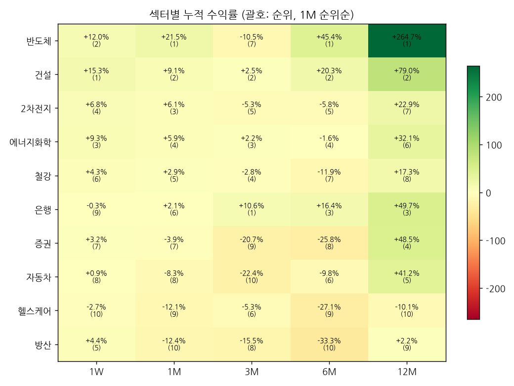

# 섹터 로테이션 & 관심종목 리포트 — 2026-09-09 (weekly)

## 1. 시그널
- 🔴 **[주도 약화] 은행** — 12M 3위·6M 3위 → 1M 6위·1W 9위
- 🔵 **[주도 지속] 건설** — 전 기간 상위권

## 2. 섹터 누적수익률 맵 (1M 순위순)
| 섹터 | 1W | 1M | 3M | 6M | 12M |
|---|---|---|---|---|---|
| **반도체** | +12.0% (2위) | +21.5% (1위) | -10.5% (7위) | +45.4% (1위) | +264.7% (1위) |
| **건설** | +15.3% (1위) | +9.1% (2위) | +2.5% (2위) | +20.3% (2위) | +79.0% (2위) |
| **2차전지** | +6.8% (4위) | +6.1% (3위) | -5.3% (5위) | -5.8% (5위) | +22.9% (7위) |
| **에너지화학** | +9.3% (3위) | +5.9% (4위) | +2.2% (3위) | -1.6% (4위) | +32.1% (6위) |
| **철강** | +4.3% (6위) | +2.9% (5위) | -2.8% (4위) | -11.9% (7위) | +17.3% (8위) |
| **은행** | -0.3% (9위) | +2.1% (6위) | +10.6% (1위) | +16.4% (3위) | +49.7% (3위) |
| **증권** | +3.2% (7위) | -3.9% (7위) | -20.7% (9위) | -25.8% (8위) | +48.5% (4위) |
| **자동차** | +0.9% (8위) | -8.3% (8위) | -22.4% (10위) | -9.8% (6위) | +41.2% (5위) |
| **헬스케어** | -2.7% (10위) | -12.1% (9위) | -5.3% (6위) | -27.1% (9위) | -10.1% (10위) |
| **방산** | +4.4% (5위) | -12.4% (10위) | -15.5% (8위) | -33.3% (10위) | +2.2% (9위) |

## 3. 관심종목 자동 업데이트
변동 없음

## 4. 기술적 지표 점검
### 삼성전자 (005930) — 현재가 269,500
- **이평선**: 혼조 · MA5 262,900▲ / MA20 262,550▲ / MA60 275,400▼ / MA120 261,450▲
- **크로스(최근)**: 데드 5/20 (2026-09-03), 골든 5/20 (2026-09-09), MA5 상향돌파, MA20 상향돌파, MA120 상향돌파
- **거래량**: 보합 · 5/20일 0.8x · 20/60일 0.77x · 당일/20일 0.76x
- **120일 매물벽**: 275,073 (+2.1%, 비중 6.1%) · 상단 총매물 43.8% → 매물대 중간 · 최대매물대 266,427 (-1.1%)
- **Cup&Handle**: 패턴 미성립 (점수 42) · 깊이 49.5% · 컵 28일 · 핸들 16일/되돌림 15.6% · 피벗 288,000 (+6.9%)
  - 미충족: 컵 길이 ≥30일, 우측 회복 ≥85%, 핸들 되돌림 ≤15%, 핸들 컵 상단 절반

### SK하이닉스 (000660) — 현재가 1,856,000
- **이평선**: 혼조 · MA5 1,735,000▲ / MA20 1,670,000▲ / MA60 1,933,383▼ / MA120 1,713,167▲
- **크로스(최근)**: MA5 상향돌파, MA20 상향돌파, MA120 상향돌파
- **거래량**: 보합 · 5/20일 0.87x · 20/60일 0.71x · 당일/20일 0.92x
- **120일 매물벽**: 1,941,938 (+4.6%, 비중 5.8%) · 상단 총매물 39.3% → 매물대 중간 · 최대매물대 1,669,312 (-10.1%)
- **Cup&Handle**: 패턴 미성립 (점수 28) · 깊이 58.3% · 컵 24일 · 핸들 1일/되돌림 5.0% · 피벗 1,889,000 (+1.8%)
  - 미충족: 깊이 12~50%, 컵 길이 ≥30일, 우측 회복 ≥85%, 핸들 5~25일, 핸들 컵 상단 절반

### 현대차 (005380) — 현재가 388,000
- **이평선**: 혼조 · MA5 386,600▲ / MA20 405,900▼ / MA60 440,125▼ / MA120 507,050▼
- **크로스(최근)**: MA5 상향돌파
- **거래량**: 보합 · 5/20일 0.7x · 20/60일 0.7x · 당일/20일 0.57x
- **120일 매물벽**: 403,323 (+3.9%, 비중 6.2%) · 상단 총매물 93.1% → 매물대 하단(무거움) · 최대매물대 495,927 (+27.8%)
- **Cup&Handle**: 패턴 미성립 (점수 42) · 깊이 56.8% · 컵 41일 · 핸들 16일/되돌림 18.5% · 피벗 459,500 (+18.4%)
  - 미충족: 깊이 12~50%, 우측 회복 ≥85%, 핸들 되돌림 ≤15%, 핸들 컵 상단 절반

---
_자동 생성. 투자 판단의 참고 자료이며 매매 권유가 아닙니다._