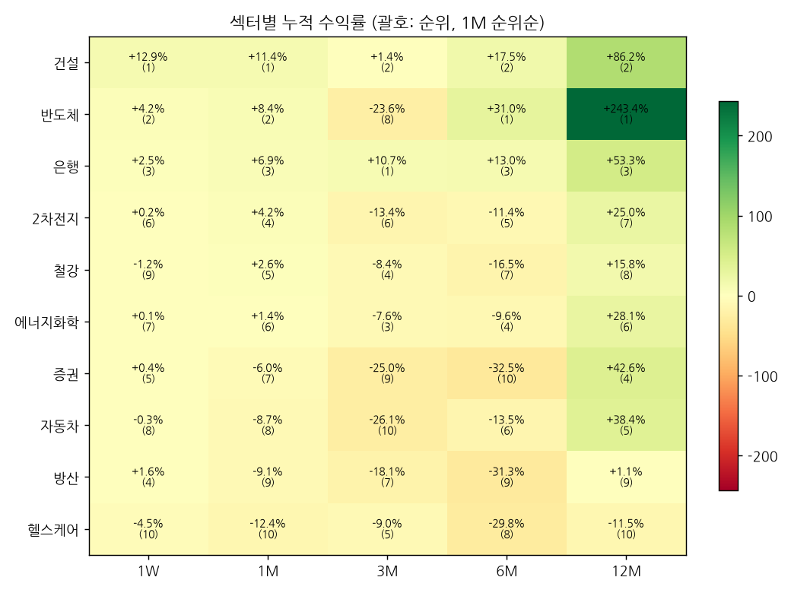

# 섹터 로테이션 & 관심종목 리포트 — 2026-09-13 (weekly)

## 1. 시그널
- 🔴 **[1W 순위 급변] 에너지화학** — 3위 → 7위 (▼4)
- 🟢 **[1W 순위 급변] 은행** — 9위 → 3위 (▲6)
- 🟢 **[1M 순위 급변] 은행** — 6위 → 3위 (▲3)
- 🔵 **[주도 지속] 건설** — 전 기간 상위권
- 🔵 **[주도 지속] 은행** — 전 기간 상위권

_순위변동 기준: 2026-09-09 리포트 대비_

## 2. 섹터 누적수익률 맵 (1M 순위순)
| 섹터 | 1W | 1M | 3M | 6M | 12M |
|---|---|---|---|---|---|
| **건설** | +12.9% (1위) | +11.4% (1위 ▲1) | +1.4% (2위) | +17.5% (2위) | +86.2% (2위) |
| **반도체** | +4.2% (2위) | +8.4% (2위 ▼1) | -23.6% (8위 ▼1) | +31.0% (1위) | +243.4% (1위) |
| **은행** | +2.5% (3위 ▲6) | +6.9% (3위 ▲3) | +10.7% (1위) | +13.0% (3위) | +53.3% (3위) |
| **2차전지** | +0.2% (6위 ▼2) | +4.2% (4위 ▼1) | -13.4% (6위 ▼1) | -11.4% (5위) | +25.0% (7위) |
| **철강** | -1.2% (9위 ▼3) | +2.6% (5위) | -8.4% (4위) | -16.5% (7위) | +15.8% (8위) |
| **에너지화학** | +0.1% (7위 ▼4) | +1.4% (6위 ▼2) | -7.6% (3위) | -9.6% (4위) | +28.1% (6위) |
| **증권** | +0.4% (5위 ▲2) | -6.0% (7위) | -25.0% (9위) | -32.5% (10위 ▼2) | +42.6% (4위) |
| **자동차** | -0.3% (8위) | -8.7% (8위) | -26.1% (10위) | -13.5% (6위) | +38.4% (5위) |
| **방산** | +1.6% (4위 ▲1) | -9.1% (9위 ▲1) | -18.1% (7위 ▲1) | -31.3% (9위 ▲1) | +1.1% (9위) |
| **헬스케어** | -4.5% (10위) | -12.4% (10위 ▼1) | -9.0% (5위 ▲1) | -29.8% (8위 ▲1) | -11.5% (10위) |

## 3. 관심종목 자동 업데이트
변동 없음

## 4. 기술적 지표 점검
### 삼성전자 (005930) — 현재가 259,500
- **이평선**: 혼조 · MA5 267,500▼ / MA20 262,800▼ / MA60 272,717▼ / MA120 262,446▼
- **크로스(최근)**: 골든 5/20 (2026-09-09), MA5 하향이탈, MA20 하향이탈, MA120 하향이탈
- **거래량**: 보합 · 5/20일 0.94x · 20/60일 0.72x · 당일/20일 0.7x
- **120일 매물벽**: 266,427 (+2.7%, 비중 9.9%) · 상단 총매물 53.8% → 매물대 하단(무거움) · 최대매물대 266,427 (+2.7%)
- **Cup&Handle**: 패턴 미성립 (점수 42) · 깊이 49.5% · 컵 28일 · 핸들 18일/되돌림 15.6% · 피벗 288,000 (+11.0%)
  - 미충족: 컵 길이 ≥30일, 우측 회복 ≥85%, 핸들 되돌림 ≤15%, 핸들 컵 상단 절반

### SK하이닉스 (000660) — 현재가 1,812,000
- **이평선**: 혼조 · MA5 1,819,400▼ / MA20 1,698,400▲ / MA60 1,912,750▼ / MA120 1,726,467▲
- **크로스(최근)**: MA5 하향이탈, MA120 상향돌파
- **거래량**: 보합 · 5/20일 0.98x · 20/60일 0.69x · 당일/20일 0.71x
- **120일 매물벽**: 1,851,062 (+2.2%, 비중 7.8%) · 상단 총매물 47.1% → 매물대 중간 · 최대매물대 1,669,312 (-7.9%)
- **Cup&Handle**: 패턴 미성립 (점수 28) · 깊이 58.3% · 컵 24일 · 핸들 1일/되돌림 6.5% · 피벗 1,890,000 (+4.3%)
  - 미충족: 깊이 12~50%, 컵 길이 ≥30일, 우측 회복 ≥85%, 핸들 5~25일, 핸들 컵 상단 절반

### 현대차 (005380) — 현재가 382,500
- **이평선**: 역배열 · MA5 387,500▼ / MA20 403,075▼ / MA60 432,017▼ / MA120 504,588▼
- **크로스(최근)**: MA5 하향이탈
- **거래량**: 보합 · 5/20일 0.8x · 20/60일 0.73x · 당일/20일 0.88x
- **120일 매물벽**: 384,802 (+0.6%, 비중 5.4%) · 상단 총매물 97.8% → 매물대 하단(무거움) · 최대매물대 495,927 (+29.7%)
- **Cup&Handle**: 패턴 미성립 (점수 42) · 깊이 56.8% · 컵 41일 · 핸들 18일/되돌림 18.5% · 피벗 459,500 (+20.1%)
  - 미충족: 깊이 12~50%, 우측 회복 ≥85%, 핸들 되돌림 ≤15%, 핸들 컵 상단 절반

---
_자동 생성. 투자 판단의 참고 자료이며 매매 권유가 아닙니다._