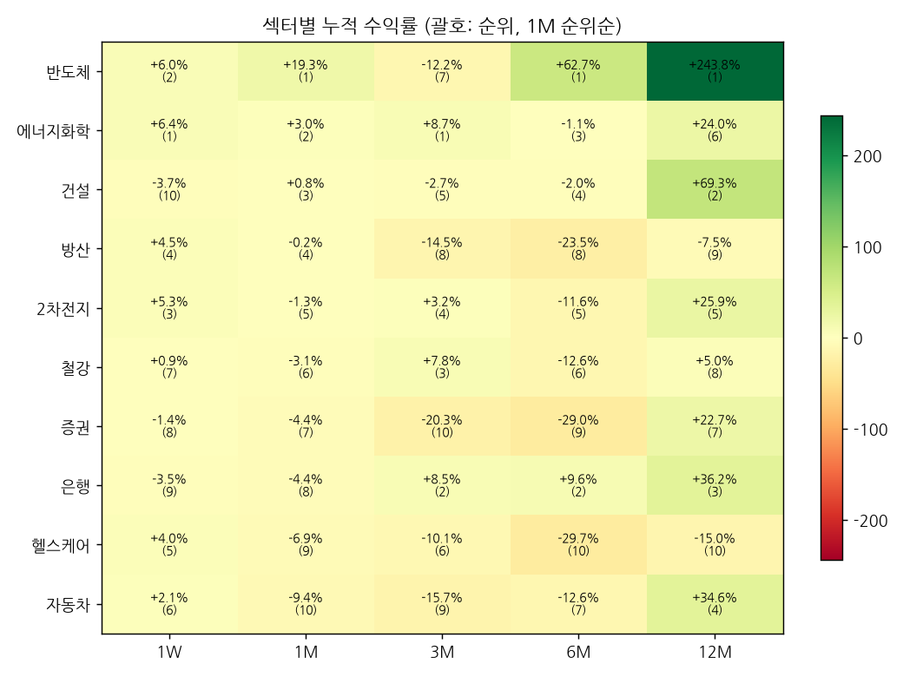

# 섹터 로테이션 & 관심종목 리포트 — 2026-10-05 (monthly)

## 1. 시그널
- 🔴 **[주도 약화] 건설** — 12M 2위·6M 4위 → 1M 3위·1W 10위
- 🔴 **[1W 순위 급변] 건설** — 1위 → 10위 (▼9)
- 🔴 **[3M 순위 급변] 건설** — 2위 → 5위 (▼3)
- 🔴 **[주도 약화] 은행** — 12M 3위·6M 2위 → 1M 8위·1W 9위
- 🔴 **[1W 순위 급변] 은행** — 3위 → 9위 (▼6)
- 🔴 **[1M 순위 급변] 은행** — 3위 → 8위 (▼5)
- 🟢 **[1M 순위 급변] 방산** — 9위 → 4위 (▲5)
- 🟢 **[1W 순위 급변] 에너지화학** — 7위 → 1위 (▲6)
- 🟢 **[1M 순위 급변] 에너지화학** — 6위 → 2위 (▲4)
- 🟢 **[1W 순위 급변] 헬스케어** — 10위 → 5위 (▲5)

_순위변동 기준: 2026-09-13 리포트 대비_

## 2. 섹터 누적수익률 맵 (1M 순위순)
| 섹터 | 1W | 1M | 3M | 6M | 12M |
|---|---|---|---|---|---|
| **반도체** | +6.0% (2위) | +19.3% (1위 ▲1) | -12.2% (7위 ▲1) | +62.7% (1위) | +243.8% (1위) |
| **에너지화학** | +6.4% (1위 ▲6) | +3.0% (2위 ▲4) | +8.7% (1위 ▲2) | -1.1% (3위 ▲1) | +24.0% (6위) |
| **건설** | -3.7% (10위 ▼9) | +0.8% (3위 ▼2) | -2.7% (5위 ▼3) | -2.0% (4위 ▼2) | +69.3% (2위) |
| **방산** | +4.5% (4위) | -0.2% (4위 ▲5) | -14.5% (8위 ▼1) | -23.5% (8위 ▲1) | -7.5% (9위) |
| **2차전지** | +5.3% (3위 ▲3) | -1.3% (5위 ▼1) | +3.2% (4위 ▲2) | -11.6% (5위) | +25.9% (5위 ▲2) |
| **철강** | +0.9% (7위 ▲2) | -3.1% (6위 ▼1) | +7.8% (3위 ▲1) | -12.6% (6위 ▲1) | +5.0% (8위) |
| **증권** | -1.4% (8위 ▼3) | -4.4% (7위) | -20.3% (10위 ▼1) | -29.0% (9위 ▲1) | +22.7% (7위 ▼3) |
| **은행** | -3.5% (9위 ▼6) | -4.4% (8위 ▼5) | +8.5% (2위 ▼1) | +9.6% (2위 ▲1) | +36.2% (3위) |
| **헬스케어** | +4.0% (5위 ▲5) | -6.9% (9위 ▲1) | -10.1% (6위 ▼1) | -29.7% (10위 ▼2) | -15.0% (10위) |
| **자동차** | +2.1% (6위 ▲2) | -9.4% (10위 ▼2) | -15.7% (9위 ▲1) | -12.6% (7위 ▼1) | +34.6% (4위 ▲1) |

## 3. 관심종목 자동 업데이트
변동 없음

## 4. 기술적 지표 점검
### 삼성전자 (005930) — 현재가 276,000
- **이평선**: 혼조 · MA5 273,000▲ / MA20 265,775▲ / MA60 258,867▲ / MA120 271,288▲
- **크로스(최근)**: MA5 상향돌파, MA120 상향돌파
- **거래량**: 보합 · 5/20일 0.95x · 20/60일 0.7x · 당일/20일 0.69x
- **120일 매물벽**: 277,990 (+0.7%, 비중 6.9%) · 상단 총매물 45.2% → 매물대 중간 · 최대매물대 262,548 (-4.9%)
- **Cup&Handle**: 패턴 미성립 (점수 28) · 깊이 49.5% · 컵 28일 · 핸들 31일/되돌림 15.6% · 피벗 288,000 (+4.3%)
  - 미충족: 컵 길이 ≥30일, 우측 회복 ≥85%, 핸들 5~25일, 핸들 되돌림 ≤15%, 핸들 컵 상단 절반

### SK하이닉스 (000660) — 현재가 1,842,000
- **이평선**: 혼조 · MA5 1,800,800▲ / MA20 1,784,700▲ / MA60 1,737,217▲ / MA120 1,822,275▲
- **크로스(최근)**: 골든 20/60 (2026-09-30), 데드 60/120 (2026-09-28), MA5 상향돌파, MA60 상향돌파, MA120 상향돌파
- **거래량**: 보합 · 5/20일 0.86x · 20/60일 0.68x · 당일/20일 0.63x
- **120일 매물벽**: 1,863,688 (+1.2%, 비중 9.5%) · 상단 총매물 49.9% → 매물대 중간 · 최대매물대 1,697,271 (-7.9%)
- **Cup&Handle**: 패턴 미성립 (점수 42) · 깊이 58.3% · 컵 24일 · 핸들 6일/되돌림 10.3% · 피벗 1,935,000 (+5.0%)
  - 미충족: 깊이 12~50%, 컵 길이 ≥30일, 우측 회복 ≥85%, 핸들 컵 상단 절반

### 현대차 (005380) — 현재가 347,000
- **이평선**: 역배열 · MA5 349,500▼ / MA20 368,150▼ / MA60 397,092▼ / MA120 491,229▼
- **크로스(최근)**: 없음
- **거래량**: 보합 · 5/20일 0.99x · 20/60일 0.69x · 당일/20일 0.99x
- **120일 매물벽**: 384,802 (+10.9%, 비중 5.7%) · 상단 총매물 100.0% → 매물대 하단(무거움) · 최대매물대 403,323 (+16.2%)
- **Cup&Handle**: 패턴 미성립 (점수 28) · 깊이 56.8% · 컵 41일 · 핸들 31일/되돌림 25.4% · 피벗 459,500 (+32.4%)
  - 미충족: 깊이 12~50%, 우측 회복 ≥85%, 핸들 5~25일, 핸들 되돌림 ≤15%, 핸들 컵 상단 절반

### [섹터] 반도체 (-) — 현재가 148,780
- **이평선**: 혼조 · MA5 143,723▲ / MA20 133,514▲ / MA60 126,757▲ / MA120 136,727▲
- **크로스(최근)**: 없음
- **거래량**: 보합 · 5/20일 1.0x · 20/60일 0.93x · 당일/20일 1.24x
- **120일 매물벽**: 149,222 (+0.3%, 비중 5.9%) · 상단 총매물 44.1% → 매물대 중간 · 최대매물대 124,251 (-16.5%)

### [섹터] 자동차 (-) — 현재가 25,600
- **이평선**: 혼조 · MA5 25,369▲ / MA20 26,186▼ / MA60 28,025▼ / MA120 31,210▼
- **크로스(최근)**: MA5 상향돌파
- **거래량**: 보합 · 5/20일 0.98x · 20/60일 0.37x · 당일/20일 0.93x
- **120일 매물벽**: 31,776 (+24.1%, 비중 6.6%) · 상단 총매물 99.1% → 매물대 하단(무거움) · 최대매물대 39,119 (+52.8%)
- **Cup&Handle**: 패턴 미성립 (점수 42) · 깊이 41.5% · 컵 41일 · 핸들 31일/되돌림 22.3% · 피벗 32,085 (+25.3%)
  - 미충족: 우측 회복 ≥85%, 핸들 5~25일, 핸들 되돌림 ≤15%, 핸들 컵 상단 절반

### [섹터] 은행 (-) — 현재가 15,755
- **이평선**: 혼조 · MA5 16,132▼ / MA20 16,511▼ / MA60 16,064▼ / MA120 15,573▲
- **크로스(최근)**: 데드 5/20 (2026-09-28), MA5 하향이탈, MA20 하향이탈, MA60 하향이탈
- **거래량**: 보합 · 5/20일 0.88x · 20/60일 0.6x · 당일/20일 0.63x
- **120일 매물벽**: 15,852 (+0.6%, 비중 7.0%) · 상단 총매물 30.8% → 매물대 중간 · 최대매물대 15,542 (-1.4%)
- **Cup&Handle**: ✅ 패턴 성립 (점수 85) · 깊이 24.9% · 컵 7일 · 핸들 12일/되돌림 8.9% · 피벗 17,172 (+9.0%)
  - 미충족: 컵 길이 ≥30일

### [섹터] 증권 (-) — 현재가 17,600
- **이평선**: 혼조 · MA5 17,467▲ / MA20 17,814▼ / MA60 18,824▼ / MA120 22,417▼
- **크로스(최근)**: MA5 상향돌파
- **거래량**: 보합 · 5/20일 0.99x · 20/60일 0.46x · 당일/20일 1.02x
- **120일 매물벽**: 26,867 (+52.7%, 비중 6.4%) · 상단 총매물 98.2% → 매물대 하단(무거움) · 최대매물대 28,344 (+61.0%)
- **Cup&Handle**: 패턴 미성립 (점수 28) · 깊이 52.3% · 컵 58일 · 핸들 33일/되돌림 16.8% · 피벗 20,460 (+16.3%)
  - 미충족: 깊이 12~50%, 우측 회복 ≥85%, 핸들 5~25일, 핸들 되돌림 ≤15%, 핸들 컵 상단 절반

### [섹터] 건설 (-) — 현재가 6,705
- **이평선**: 혼조 · MA5 6,809▼ / MA20 7,069▼ / MA60 6,534▲ / MA120 7,304▼
- **크로스(최근)**: 데드 5/20 (2026-09-30), MA20 하향이탈
- **거래량**: 보합 · 5/20일 0.69x · 20/60일 1.21x · 당일/20일 0.55x
- **120일 매물벽**: 6,916 (+3.1%, 비중 5.6%) · 상단 총매물 74.9% → 매물대 하단(무거움) · 최대매물대 9,285 (+38.5%)
- **Cup&Handle**: 패턴 미성립 (점수 42) · 깊이 51.5% · 컵 63일 · 핸들 13일/되돌림 12.3% · 피벗 7,585 (+13.1%)
  - 미충족: 깊이 12~50%, 우측 회복 ≥85%, 핸들 컵 상단 절반, 핸들 거래량 감소

### [섹터] 철강 (-) — 현재가 12,370
- **이평선**: 혼조 · MA5 12,158▲ / MA20 12,524▼ / MA60 11,820▲ / MA120 13,373▼
- **크로스(최근)**: MA5 상향돌파
- **거래량**: 급증 · 5/20일 1.72x · 20/60일 0.87x · 당일/20일 0.64x
- **120일 매물벽**: 12,467 (+0.8%, 비중 8.6%) · 상단 총매물 70.8% → 매물대 하단(무거움) · 최대매물대 12,105 (-2.1%)
- **Cup&Handle**: ✅ 패턴 성립 (점수 71) · 깊이 48.1% · 컵 103일 · 핸들 24일/되돌림 11.5% · 피벗 13,400 (+8.3%)
  - 미충족: 우측 회복 ≥85%, 핸들 컵 상단 절반

### [섹터] 에너지화학 (-) — 현재가 14,635
- **이평선**: 혼조 · MA5 14,208▲ / MA20 14,026▲ / MA60 13,463▲ / MA120 14,747▼
- **크로스(최근)**: 골든 5/20 (2026-10-01), MA20 상향돌파
- **거래량**: 보합 · 5/20일 0.75x · 20/60일 1.11x · 당일/20일 1.23x
- **120일 매물벽**: 15,684 (+7.2%, 비중 6.6%) · 상단 총매물 58.8% → 매물대 하단(무거움) · 최대매물대 13,957 (-4.6%)
- **Cup&Handle**: ✅ 패턴 성립 (점수 71) · 깊이 42.9% · 컵 59일 · 핸들 14일/되돌림 11.4% · 피벗 15,130 (+3.4%)
  - 미충족: 우측 회복 ≥85%, 핸들 컵 상단 절반

### [섹터] 헬스케어 (-) — 현재가 16,210
- **이평선**: 혼조 · MA5 16,026▲ / MA20 16,177▲ / MA60 16,712▼ / MA120 18,196▼
- **크로스(최근)**: MA5 상향돌파, MA20 상향돌파
- **거래량**: 급증 · 5/20일 1.68x · 20/60일 0.54x · 당일/20일 1.12x
- **120일 매물벽**: 17,494 (+7.9%, 비중 6.2%) · 상단 총매물 87.4% → 매물대 하단(무거움) · 최대매물대 17,827 (+10.0%)
- **Cup&Handle**: 패턴 미성립 (점수 42) · 깊이 42.3% · 컵 103일 · 핸들 35일/되돌림 19.5% · 피벗 19,285 (+19.0%)
  - 미충족: 우측 회복 ≥85%, 핸들 5~25일, 핸들 되돌림 ≤15%, 핸들 컵 상단 절반

### [섹터] 2차전지 (-) — 현재가 15,080
- **이평선**: 혼조 · MA5 14,638▲ / MA20 14,714▲ / MA60 14,030▲ / MA120 16,272▼
- **크로스(최근)**: MA5 상향돌파, MA20 상향돌파
- **거래량**: 보합 · 5/20일 1.19x · 20/60일 1.12x · 당일/20일 1.21x
- **120일 매물벽**: 15,236 (+1.0%, 비중 6.2%) · 상단 총매물 68.1% → 매물대 하단(무거움) · 최대매물대 14,744 (-2.2%)
- **Cup&Handle**: 패턴 미성립 (점수 42) · 깊이 51.6% · 컵 57일 · 핸들 21일/되돌림 11.6% · 피벗 15,950 (+5.8%)
  - 미충족: 깊이 12~50%, 우측 회복 ≥85%, 핸들 컵 상단 절반, 핸들 거래량 감소

### [섹터] 방산 (-) — 현재가 52,250
- **이평선**: 혼조 · MA5 50,482▲ / MA20 51,308▲ / MA60 52,859▼ / MA120 61,608▼
- **크로스(최근)**: MA5 상향돌파, MA20 상향돌파
- **거래량**: 보합 · 5/20일 1.04x · 20/60일 0.73x · 당일/20일 1.33x
- **120일 매물벽**: 70,172 (+34.3%, 비중 5.8%) · 상단 총매물 85.2% → 매물대 하단(무거움) · 최대매물대 78,557 (+50.3%)
- **Cup&Handle**: 패턴 미성립 (점수 28) · 깊이 51.7% · 컵 101일 · 핸들 32일/되돌림 17.9% · 피벗 59,520 (+13.9%)
  - 미충족: 깊이 12~50%, 우측 회복 ≥85%, 핸들 5~25일, 핸들 되돌림 ≤15%, 핸들 컵 상단 절반

---
_자동 생성. 투자 판단의 참고 자료이며 매매 권유가 아닙니다._